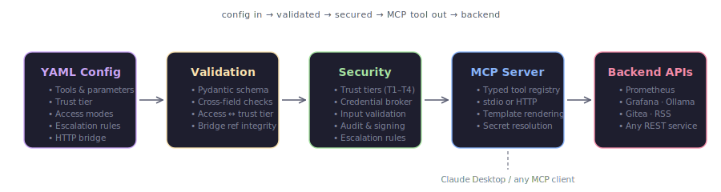

<h1 align="center">Heddle</h1>
<p align="center"><strong>The policy-and-trust layer for MCP tool servers.</strong></p>
<p align="center">
  Heddle turns declarative configs into <a href="https://modelcontextprotocol.io/">Model Context Protocol</a> servers<br>
  with trust enforcement, credential brokering, and tamper-evident audit logging built in.
</p>
<p align="center">
  <a href="#see-it-work">See It Work</a> ·
  <a href="#why-heddle">Why Heddle</a> ·
  <a href="#current-status">Current Status</a> ·
  <a href="#security-architecture">Security</a> ·
  <a href="#quick-start">Quick Start</a>
</p>

---

<h2 id="see-it-work">See It Work</h2>

<p align="center">
  
</p>

**One config, one MCP server.** This YAML is a complete tool server — no Python, no boilerplate:

```yaml
agent:
  name: prometheus-bridge
  version: "1.0.0"
  description: "Bridges Prometheus for natural language metric queries"
  exposes:
    - name: query_prometheus
      description: "Run a PromQL query"
      parameters:
        query: { type: string, required: true }
    - name: get_alerts
      description: "List active Prometheus alerts"
  http_bridge:
    - tool_name: query_prometheus
      method: GET
      url: "http://localhost:9090/api/v1/query"
      query_params: { query: query }
    - tool_name: get_alerts
      method: GET
      url: "http://localhost:9090/api/v1/alerts"
  runtime:
    trust_tier: 1  # enforced: GET/HEAD only, no writes, no cross-agent calls
```

Run it:

```bash
heddle run agents/prometheus-bridge.yaml
```

Claude can now query Prometheus in natural language.

**Current demo environment:** 46 tools from 9 active configs through a single MCP connection (11 configs total, 2 excluded for incompatible transports).

```text
daily-ops        (T3): daily_briefing, system_health_check, threat_landscape
gitea-api-bridge (T1): list_user_repos, list_repo_issues
grafana-bridge   (T1): list_dashboards, get_dashboard, list_datasources, get_alert_rules, grafana_health
ai-platform      (T1): health, ai_status, routing_stats, routing_costs, list_apps, detect_drift, ...
ollama-bridge    (T2): list_models, list_running, generate, show_model
prometheus-bridge(T1): query_prometheus, query_range, get_targets, get_alerts, get_metric_names
rsshub-bridge    (T1): get_hacker_news, get_github_trending, search_arxiv, get_reuters_news
vram-orchestrator(T3): vram_status, smart_load, smart_generate, optimize_vram, unload_model, model_library
intel-rag-bridge (T2): ask_intel, get_dossier, get_trending, get_patterns, get_communities, get_stats, ...
```

**Security is always on.** Every tool call passes through trust enforcement, credential brokering, and audit logging.

Example: a T1 (read-only) agent attempted a POST and was blocked:

```json
{
  "event": "trust_violation",
  "agent": "reader",
  "trust_tier": 1,
  "action": "http_POST",
  "detail": "T1 agent cannot use POST. Allowed: ['GET', 'HEAD', 'OPTIONS']",
  "severity": "high",
  "chain_hash": "92c189e3..."
}
```

The request was rejected, the violation was logged, and the hash chain links this entry to every event before and after it.

---

<h2 id="why-heddle">Why Heddle Instead Of...</h2>

| | **Heddle** | **Hand-written FastMCP** | **OpenAPI wrapper gen** | **n8n / workflow tools** |
|:--:|:--:|:--:|:--:|:--:|
| **New tool** | Write YAML, done | Write Python handler per tool | Generate stubs, then customize | Drag nodes, wire connections |
| **Security** | Trust tiers, credential broker, audit log, input validation, config signing — all built in | You build it yourself | None | Platform-level auth only |
| **AI-generatable** | `heddle generate "wrap the Gitea API"` → valid config in 20s | LLM can write code but can't validate it | Not designed for LLM generation | Visual-only, not scriptable |
| **Credentials** | `{{secret:key}}` resolved at runtime, never in config | Hardcoded or env vars | Hardcoded or env vars | Platform credential store |
| **Audit trail** | Hash-chained, tamper-evident, every call logged | You build it yourself | None | Platform logs only |
| **Composability** | Configs become MCP tools, mesh them together | Manual wiring | Separate services | Workflow-scoped |

Heddle is for exposing APIs as MCP tools with real runtime controls — not just connectivity. If you only need one tool with no policy layer, hand-written FastMCP is simpler. If you need a visual workflow builder, use n8n. Heddle sits between those worlds: declarative like a workflow tool, programmable like a framework, secure by default.

---

## How It Works

<p align="center">
  
</p>

<h2 id="current-status">Current Status</h2>

What Heddle can do today, what is partially implemented, and what is still planned:

| Layer | Status | Detail |
|:-----:|:------:|:-------|
| Config → MCP server | **Shipped** | YAML configs become typed MCP tools with HTTP bridging |
| Trust tiers (T1–T4) | **Shipped** | Runtime-enforced, violations blocked and logged |
| Credential broker | **Shipped** | Per-config secret policy, `{{secret:key}}` resolution |
| Audit logging | **Shipped** | Hash-chained JSON Lines, tamper-evident |
| Input validation | **Shipped** | Type checking, injection detection, rate limiting |
| Access mode annotations | **Shipped** | read/write on tools, T1 write blocked at load + runtime |
| Escalation rules | **Shipped** | Conditional hold-for-review on parameter thresholds |
| Config signing | **Shipped** | HMAC-SHA256, tamper detection |
| Config quarantine | **Shipped** | AI-generated configs staged for review |
| AI config generator | **Shipped** | Natural language → validated YAML via local LLM |
| Sandbox policies | **Partial** | Container config generation exists; runtime isolation not yet enforced |
| Network isolation | **Planned** | Container-level network enforcement |

## Core Features

### Declarative Tool Configs

Define tools in YAML. Heddle validates the config with Pydantic, generates typed MCP tools, and bridges HTTP with `{{param}}` template rendering. Cross-field validation catches bad configs before they run.

### AI Config Generator

Describe what you need in plain English. A local LLM generates valid YAML, Heddle validates it against schema rules, retries on failure, and saves the result.

```bash
$ heddle generate "agent that wraps the Gitea API" --model qwen3:14b
✓ Generated gitea-api-bridge.yaml (2 tools) in 20.3s
```

<h3 id="security-architecture">Security Architecture</h3>

Heddle's security controls map to OWASP Agentic Top 10, NIST AI RMF, and MAESTRO. See the full [threat model](docs/threat-model.md) and [security controls reference](docs/security-controls.md).

| Control | What It Does | Framework |
|:-------:|:-------------|:---------:|
| **Trust tiers** | 4 levels (observer → privileged), runtime-enforced, violations blocked and logged | OWASP&nbsp;Agentic&nbsp;#3 |
| **Credential broker** | Per-config secret access policy, `{{secret:key}}` resolved at runtime, never stored in YAML | OWASP&nbsp;Agentic&nbsp;#7 |
| **Audit log** | Hash-chained JSON Lines, tamper-evident, 5 event types, secret redaction | OWASP&nbsp;Agentic&nbsp;#9 |
| **Input validation** | Type checking, length limits, injection pattern detection (shell, SQL, LLM prompt) | OWASP&nbsp;Agentic&nbsp;#1 |
| **Config signing** | HMAC-SHA256 on all agent configs, tamper detection | OWASP&nbsp;Agentic&nbsp;#8 |
| **Config quarantine** | AI-generated configs staged for review before promotion | OWASP&nbsp;Agentic&nbsp;#8 |
| **Rate limiting** | Sliding window per-config per-tool | OWASP&nbsp;Agentic&nbsp;#4 |
| **Sandbox policies** | Docker container config generation and network policies (enforcement planned) | OWASP&nbsp;Agentic&nbsp;#6 |
| **Escalation rules** | Conditional hold-for-review when parameters match thresholds or patterns | OWASP&nbsp;Agentic&nbsp;#3 |

---

## Starter Packs

Ready-made configs for common services. Copy one into `agents/`, update the base URL or credentials, validate, and run. See [packs/](packs/) for full docs.

| Pack | Tools | Trust | Description |
|:-----|:------|:------|:------------|
| [prometheus](packs/prometheus.yaml) | 5 | T1 read-only | PromQL queries, targets, alerts, metric discovery |
| [grafana](packs/grafana.yaml) | 5 | T1 read-only | Dashboards, datasources, alert rules |
| [git-forge](packs/git-forge.yaml) | 3 | T1 read-only | Repos, issues (Gitea/GitHub/Forgejo) |
| [ollama](packs/ollama.yaml) | 4 | T2 worker | Model listing, text generation, VRAM status |
| [sonarr](packs/sonarr.yaml) | 6 | T1 read-only | TV library, download queue, search, calendar, history |
| [radarr](packs/radarr.yaml) | 6 | T1 read-only | Movie library, download queue, search, calendar, history |

```bash
cp packs/prometheus.yaml agents/
heddle validate agents/prometheus.yaml
heddle run agents/prometheus.yaml --port 8200
```

## Advanced Examples

These show Heddle beyond simple API bridging.

### Tool Mesh

Multiple configs share a single MCP connection to Claude Desktop. The mesh launcher loads all configs, merges tools, and serves them through one stdio transport.

### VRAM Orchestrator

A higher-trust agent that manages GPU memory across Ollama and a local GGUF model library, including smart loading and automatic eviction when VRAM is constrained.

### Daily Ops Orchestrator

An orchestration agent that queries Prometheus, a RAG search API, and Ollama in parallel, then synthesizes a daily operations briefing with a local model.

### Web Dashboard

A FastAPI + React dashboard for mesh topology, agent status, live audit stream, credential policy, and config signatures.

---

<h2 id="quick-start">Quick Start</h2>

### Clone and install

```bash
git clone https://github.com/goweft/heddle.git
cd heddle
python -m venv venv
source venv/bin/activate
pip install -e ".[dev]"
```

### Validate and run a config

```bash
heddle validate agents/prometheus-bridge.yaml
heddle run agents/prometheus-bridge.yaml --port 8200
```

### Generate a new config

```bash
heddle generate "agent that wraps the weather API at localhost:5000"
```

### Run the full mesh

```bash
heddle mesh agents/
```

### Security operations

```bash
heddle audit show -n 20
heddle audit verify
heddle sign all agents/
heddle sign verify agents/
heddle secrets policy
heddle sandbox agents/my-agent.yaml
```

### Claude Desktop Integration

To expose a unified Heddle mesh to Claude Desktop:

```json
{
  "mcpServers": {
    "heddle-mesh": {
      "command": "/path/to/heddle/venv/bin/python",
      "args": ["/path/to/heddle/heddle_stdio_mesh.py"]
    }
  }
}
```

## CLI Reference

| Command | Description |
|:--------|:------------|
| `heddle run <config>` | Run a single agent from YAML |
| `heddle validate <config>` | Validate a config without running it |
| `heddle generate "<prompt>"` | Generate a config from natural language |
| `heddle mesh <dir>` | Start all agents as a unified mesh |
| `heddle list` | List registered agents |
| `heddle registry` | Show all registered tools |
| `heddle info <agent>` | Show detailed agent info |
| `heddle probe <server>` | Discover tools on a running MCP server |
| `heddle audit show` | Inspect audit log entries |
| `heddle audit verify` | Verify hash chain integrity |
| `heddle secrets` | Manage credential broker |
| `heddle sign` | Sign and verify configs |
| `heddle quarantine` | Stage AI-generated configs for review |
| `heddle sandbox <config>` | Show generated sandbox configuration |

## Project Structure

```text
heddle/
├── agents/              # YAML agent configs
├── packs/               # Starter pack configs
├── docs/
│   ├── threat-model.md  # Threat analysis, framework-mapped
│   └── security-controls.md
├── src/heddle/
│   ├── cli.py           # CLI entrypoint
│   ├── config/          # Pydantic schema and YAML loader
│   ├── mcp/             # MCP server builder, client, registry
│   ├── runtime/         # Agent runner and mesh runtime
│   ├── generator/       # AI config generator and API discovery
│   ├── security/        # Trust, credentials, audit, validation,
│   │                    #   signing, sandbox, escalation
│   ├── agents/          # Custom higher-level handlers
│   └── web/             # Dashboard backend and frontend
├── tests/
├── heddle_stdio_mesh.py # Unified Claude Desktop launcher
└── heddle_dashboard.py  # Web dashboard launcher
```

## Tech Stack

Python 3.11+ · FastMCP · FastAPI · Pydantic v2 · httpx · Click · SQLite · Ollama

## License

MIT — see [LICENSE](LICENSE).
